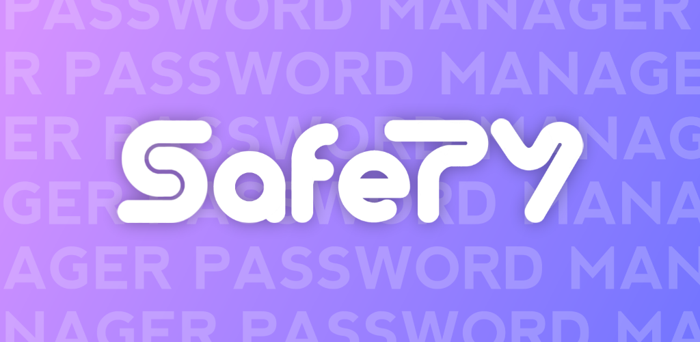
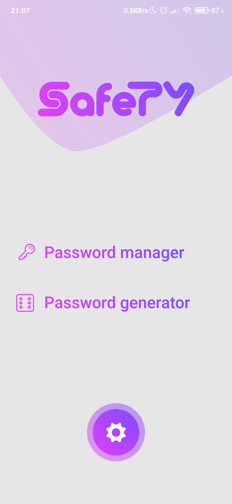
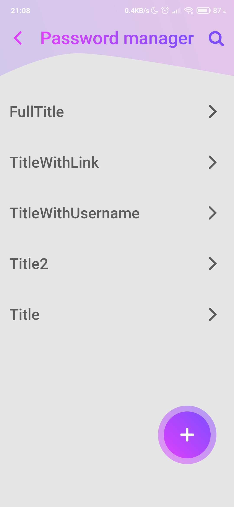
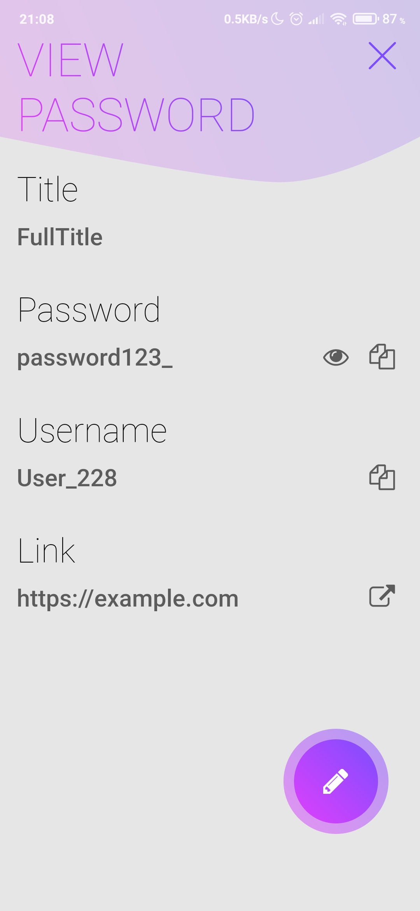
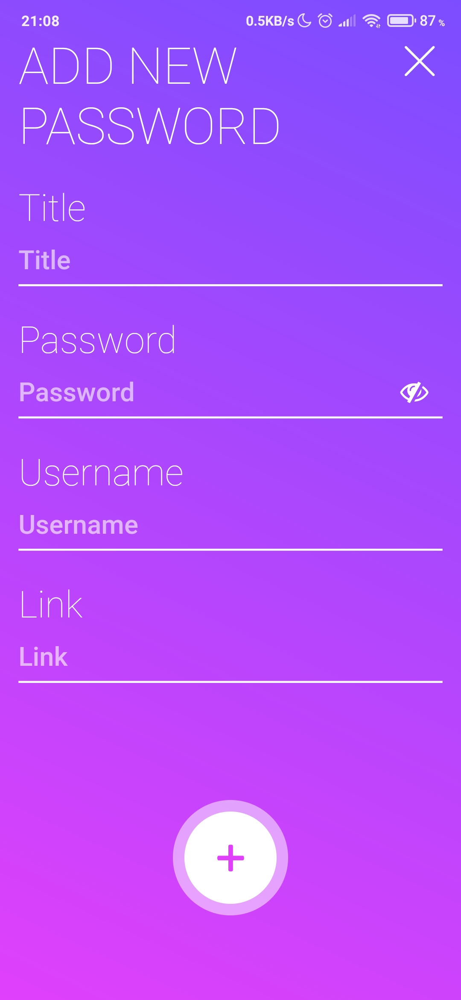
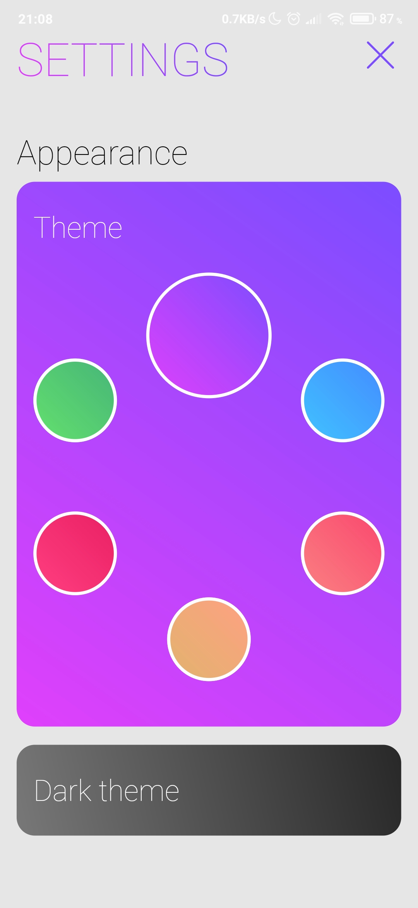

# SafeTY - Open-Source Password Manager & Generator

How serious are you about security? If you use similar password for all of your accounts, or your passwords is too short/does not contains numbers and special symbols/are frequently used, your accounts are under the threat of hacking.

# Main functions
* [x] App will help you to generate secure password
* [x] All passwords stores encrypted by AES technology
* [x] The encryption key generates from master password
* [x] Master password and key does not stores in database
* [x] You can add username and link to your password

# Some features
* [x] Nice design
* [x] Great animations
* [x] 6 colored themes
* [x] Light/dark theme
* [x] 2 languages (for translation issues: electron.devf@gmail.com)

# Soon...
* Forms autofill on some sites
* Server support to store passwords in the cloud
* New languages
* Bug fixes

# Screenshots

    

# Links

Download SafeTY:
* from Google Play (soon)
* from F-Droid (soon)
